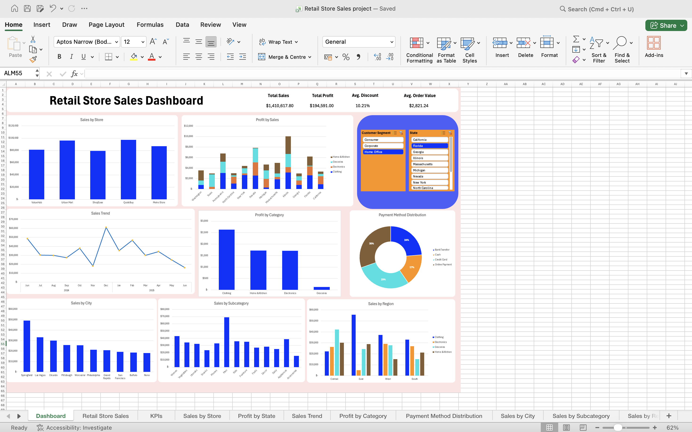

# 📊 Retail Store Sales Dashboard

## 📌 Project Overview

This project is an interactive Retail Store Sales Dashboard built using Microsoft Excel. It analyzes retail sales data and presents key business insights through KPIs, Pivot Tables, Pivot Charts, and interactive filters.

---

# 📷 Dashboard Preview

---

# 🎯 Objectives

- Analyze retail sales performance
- Track profit across different states
- Compare sales by region
- Monitor sales trends over time
- Analyze payment methods
- Identify top-performing stores and product categories

---

# 🛠 Tools Used

- Microsoft Excel
- Pivot Tables
- Pivot Charts
- Slicers
- Conditional Formatting
- GETPIVOTDATA
- Dashboard Design

---

# 📊 Dashboard Includes

- Total Sales KPI
- Total Profit KPI
- Average Sales KPI
- Sales by Store
- Sales by Region
- Sales by City
- Sales Trend
- Profit by State
- Profit by Category
- Payment Method Distribution
- Sales by Subcategory

---

# 💼 Skills Demonstrated

- Data Cleaning
- Data Analysis
- Dashboard Development
- Data Visualization
- Business Reporting
- KPI Creation
- Interactive Dashboard Design

---

# 📁 Files Included

- Retail Store Sales project.xlsx
- Dashboard Screenshot
- README.md

---

# 📈 Business Insights

This dashboard helps businesses:

- Monitor overall sales performance
- Compare store performance
- Analyze regional sales
- Identify profitable product categories
- Track monthly sales trends
- Understand customer payment preferences

---

# 🚀 Future Improvements

- Build the dashboard in Power BI
- Connect to SQL database
- Automate data cleaning using Power Query
- Add forecasting and trend analysis

---

# 👨‍💻 Author

Smit Patel

Aspiring Data Analyst

Skills:
- Excel
- SQL
- Power BI
- Python
- Data Visualization
